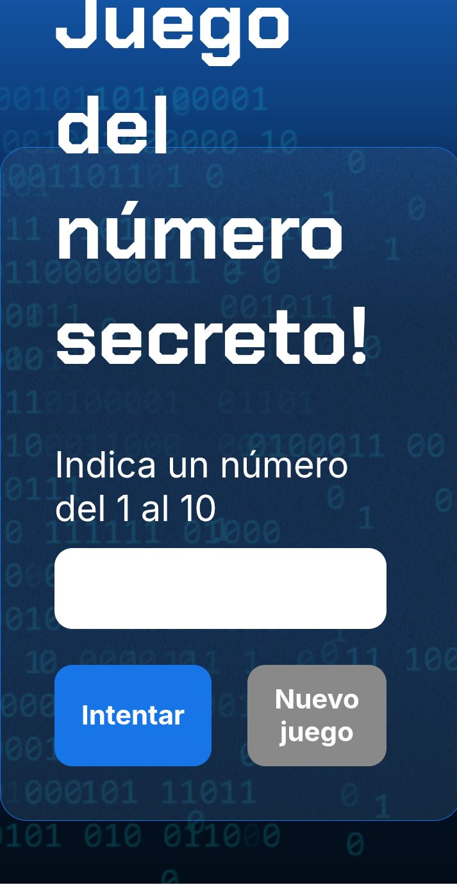

# 🎮 Juego del Número Secreto

Juego web interactivo donde el usuario debe **adivinar un número secreto generado aleatoriamente por el sistema**.

Proyecto desarrollado durante el **Challenge de lógica de programación de Alura / Oracle Next Education**.

---

# 🚀 Demo del proyecto

👉 **Probar el juego aquí**

[](https://carlosdm121.github.io/juego-secreto/)

---

# 🖥 Vista previa del proyecto



---

# 🛠 Tecnologías utilizadas

<p align="left">


</p>

---

# 📌 Descripción

El juego genera un número secreto dentro de un rango determinado.  
El usuario debe intentar adivinarlo ingresando números.

El sistema indicará si el número ingresado es:

- 🔼 Mayor que el número secreto  
- 🔽 Menor que el número secreto  
- ✅ Correcto

El objetivo es descubrir el número en **la menor cantidad de intentos posibles**.

---

# ⚙️ Funcionalidades

✔ Generación aleatoria del número secreto  
✔ Validación de números ingresados  
✔ Pistas para el jugador  
✔ Contador de intentos  
✔ Interfaz simple e interactiva  

---

# 📂 Estructura del proyecto

```
juego-secreto
 ├── index.html
 ├── style.css
 ├── app.js
 └── README.md
```

---

# ▶️ Cómo ejecutar el proyecto

Clonar el repositorio:

```
git clone https://github.com/carlosdm121/juego-secreto.git
```

Abrir el archivo:

```
index.html
```

en tu navegador.

---

# 👨‍💻 Autor

Carlos Martinez  

GitHub  
https://github.com/carlosdm121

---

⭐ Si te gustó este proyecto puedes darle **Star** al repositorio.
